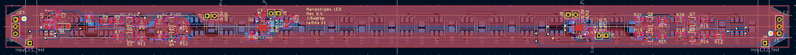
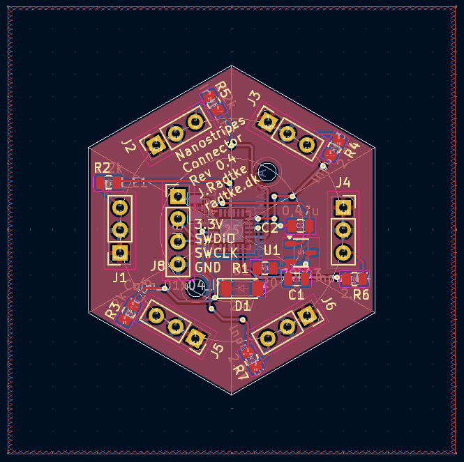

# Nanostripes Hardware

## Nanostripes Led Modul

Dies ist das Led Modul für die Nanostripes Connectoren.
Der Connector sowie das LED Modul ist den Nanoleaf Lines nachempfunden. Auf dem Controller läuft das Reverse Engineered Nanoleaf Lines Protokoll.

## Nanostripes Connector

Dies ist der Connector für die Nanostripes Led Module.
Der Connector sowie das LED Modul ist den Nanoleaf Lines nachempfunden. Auf dem Controller läuft das Reverse Engineered Nanoleaf Lines Protokoll.

